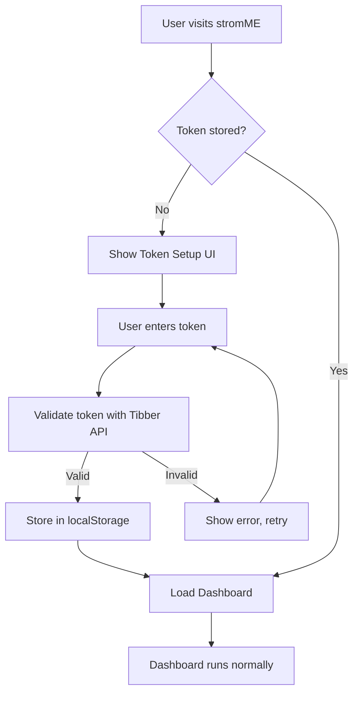

# 🔒 Secure Deployment Plan for stromME Dashboard

## Security Issue Identified
- **CRITICAL**: Tibber API token is hardcoded in `src/utils/constants.ts`
- **Risk**: Token visible to anyone accessing the deployed application
- **Solution**: Implement Runtime Token Input system

## Implementation Plan: Runtime Token Input

### 1. Security Architecture


### 2. Code Changes Required

#### A. Remove Hardcoded Token
- **File**: `src/utils/constants.ts`
- **Change**: Remove hardcoded token, set to empty string
- **Impact**: Forces runtime token input

#### B. Create Token Management Service
- **File**: `src/services/tokenService.ts` (NEW)
- **Features**:
  - Store/retrieve token from localStorage
  - Validate token format
  - Clear token functionality
  - Security helpers

#### C. Create Token Setup UI
- **File**: `src/components/TokenSetup.ts` (NEW)
- **Features**:
  - Secure token input form
  - Validation feedback
  - Setup instructions
  - Wall-display optimized design

#### D. Update Main Application
- **File**: `src/main.ts`
- **Changes**:
  - Check for token on startup
  - Show setup UI if no token
  - Initialize dashboard after token setup

#### E. Update API Service
- **File**: `src/services/tibberApi.ts`
- **Changes**:
  - Get token from tokenService instead of constants
  - Handle missing token gracefully

### 3. User Experience Flow

#### First Visit:
1. User opens stromME dashboard
2. Sees token setup screen with instructions
3. Enters Tibber API token
4. Token validated against Tibber API
5. Dashboard loads and works normally

#### Subsequent Visits:
1. Dashboard loads immediately
2. Token retrieved from localStorage
3. No setup required

#### Wall Display Benefits:
- One-time setup per device/browser
- No recurring authentication needed
- Perfect for permanent wall installations
- Secure token storage in browser only

### 4. Security Features

#### Token Storage:
- **Location**: Browser localStorage only
- **Encryption**: Browser's built-in security
- **Scope**: Per-domain, per-browser
- **Persistence**: Until manually cleared

#### Token Validation:
- **Format check**: Tibber token pattern validation
- **API test**: Real connection test before storing
- **Error handling**: Clear feedback for invalid tokens

#### Security Best Practices:
- No token in source code
- No token in build artifacts
- No token transmission to third parties
- Local storage only

### 5. Deployment Compatibility

#### GitHub Pages: ✅ FULLY COMPATIBLE
- Static files only
- No server-side requirements
- Automatic deployment via GitHub Actions
- Custom domain support

#### Other Platforms: ✅ ALSO COMPATIBLE
- Netlify: Full compatibility
- Vercel: Full compatibility
- Any static hosting: Full compatibility

### 6. Implementation Steps

1. **Remove hardcoded token** from constants
2. **Create token service** for secure storage/retrieval
3. **Build token setup UI** with wall-display styling
4. **Update main app** to handle token flow
5. **Update API service** to use dynamic token
6. **Test security** - verify no token in build
7. **Deploy to GitHub Pages** with automatic CI/CD

### 7. GitHub Pages Deployment Setup

#### Repository Configuration:
- Enable GitHub Pages in repository settings
- Source: GitHub Actions
- Custom domain: Optional

#### GitHub Actions Workflow:
```yaml
name: Deploy stromME to GitHub Pages
on:
  push:
    branches: [ main ]
jobs:
  deploy:
    runs-on: ubuntu-latest
    steps:
      - uses: actions/checkout@v3
      - uses: actions/setup-node@v3
      - run: npm install
      - run: npm run build
      - uses: actions/deploy-pages@v2
```

#### Access URL:
- Default: `https://adtechnology.github.io/stromME/`
- Custom domain: Optional setup

### 8. Benefits Summary

#### Security:
- ✅ No token in source code
- ✅ No token in deployed files
- ✅ Local browser storage only
- ✅ Per-device configuration

#### User Experience:
- ✅ One-time setup
- ✅ Wall-display optimized
- ✅ No recurring authentication
- ✅ Clear setup instructions

#### Deployment:
- ✅ GitHub Pages compatible
- ✅ Automatic updates
- ✅ Free hosting
- ✅ HTTPS by default

## Next Steps

1. Switch to Code mode
2. Implement token management system
3. Create secure setup UI
4. Test security implementation
5. Deploy to GitHub Pages
6. Provide deployment instructions

This solution provides maximum security while maintaining the simplicity and effectiveness needed for a wall-mounted electricity price dashboard.